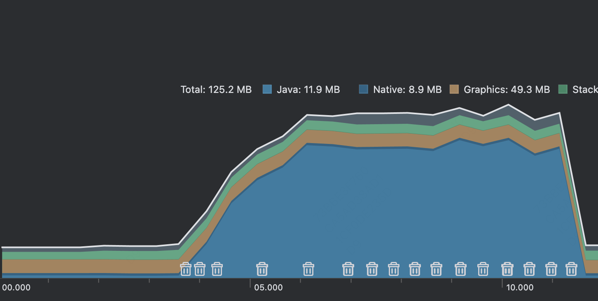
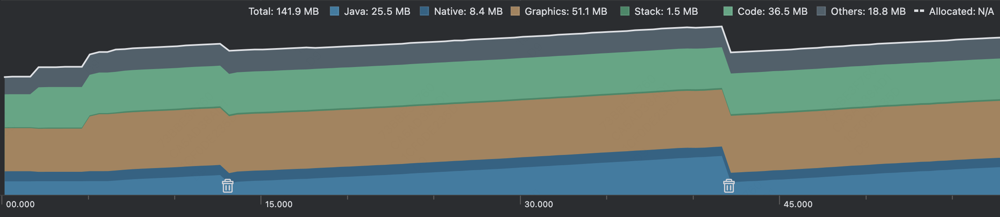

## How to reproduce
1. Run the server
2. (Optional) If use a real Android device, change the server address in `MainActivity.kt`
2. Run the App
3. Monitor the memory consumption of the App
4. Click the upload button on App and select a large video file

## Ktor 3.0.2
When using Ktor client 3.0.2, the memory consumption keeps increasing until OOM occurs.
OkHttp engine and Android engine both have the same issue.

## Ktor 2.3.13
When using Ktor client 2.3.13, the memory consumption is stable and GC makes effects.

## Ktor Server 3.0.2
When reading large multipart-form data, the server also gets OOM.
